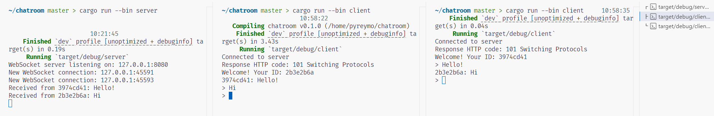

# WebSocket 聊天服务器和客户端（Rust 实现）

本项目是一个基于 WebSocket 的聊天应用程序，使用 **Rust** 编写，采用 `tokio`、`tokio-tungstenite` 和 `native-tls` 实现加密的 WebSocket 通信。它由两个主要组件构成：

1. **聊天客户端**：一个 WebSocket 客户端，连接到服务器，发送和接收消息。
2. **聊天服务器**：一个 WebSocket 服务器，允许多个客户端连接、交换消息，并管理 TLS 安全通信。

## 特性

- **实时通信**：支持多个客户端之间的实时消息发送和接收。
- **TLS 加密**：支持使用自签名证书的安全 WebSocket（WSS）连接。
- **用户身份识别**：每个客户端连接时都会分配一个唯一的标识符。
- **广播功能**：一个客户端发送的消息会广播到所有其他连接的客户端。
- **优雅的断开连接**：支持优雅地断开客户端连接。
- **基于 Tokio 的并发处理**：使用 `tokio` 异步运行时实现并发处理。

## 项目结构

本项目包括以下文件：

- **`chat_client.rs`**：WebSocket 客户端，负责与服务器建立连接并进行消息的发送和接收。
- **`chat_server.rs`**：WebSocket 服务器，管理客户端的连接并广播消息。
- **`cert.pem`** 和 **`key.pem`**：用于 TLS 连接的自签名证书和私钥（如果启用 TLS），运行时生成。

## 环境要求

- **Rust**：确保你的机器上安装了 Rust。可以从 [Rust 官网](https://www.rust-lang.org/tools/install) 安装。
- **OpenSSL**（可选）：如果你启用了 TLS 加密，可能需要安装 OpenSSL。

## 安装与运行

### 1. 克隆项目

```bash
git clone https://github.com/pyreymo/chatroom_in_rust.git
cd chatroom_in_rust
```

### 2. 安装依赖

运行以下命令来安装所需的依赖：

```bash
cargo build
```

这将编译项目并下载所需的依赖。

### 3. 启动服务器

启动服务器的命令：

```bash
cargo run --bin server
```

服务器将默认监听 `127.0.0.1:8080`。

如果启用了 TLS 加密，服务器将在首次启动时自动生成自签名证书（`cert.pem` 和 `key.pem`）。启用 TLS 后，WebSocket 连接将通过 `wss://127.0.0.1:8080` 安全通信。

### 4. 启动客户端

在另一个终端中运行聊天客户端：

```bash
cargo run --bin client
```

客户端将连接到服务器 `127.0.0.1:8080`。一旦连接成功，你可以发送和接收消息。

### 5. 发送消息

一旦客户端连接成功，你可以开始在终端中输入消息。每当你发送消息时，所有其他连接的客户端都将收到这条消息。

### 6. 支持多个客户端

你可以运行多个客户端实例来模拟一个聊天室，多个客户端可以互相发送消息。

### 7. 退出客户端

要退出客户端，按 `Ctrl+C` 或者输入一个空消息并按 `Enter`。

## 配置

- **TLS 加密**：默认情况下，服务器启用了 TLS 加密。如果你想禁用它，可以修改 `server.rs` 中的 `enable_tls` 方法。
- **服务器地址**：服务器默认绑定 `127.0.0.1:8080`，你可以在 `ChatServer::new()` 方法中修改服务器地址。
- **客户端输入处理**：客户端通过标准输入（stdin）接收消息并将其发送到 WebSocket 连接。

## 工作原理

- **服务器**：
    - 监听指定地址的 WebSocket 连接请求。
    - 接受连接后，分配一个唯一的标识符给客户端，并发送欢迎消息。
    - 接收到客户端的消息后，将消息广播给所有其他已连接的客户端。
    - 支持普通连接和 TLS 加密连接。
  
- **客户端**：
    - 连接到 WebSocket 服务器并通过终端发送消息。
    - 接收来自其他客户端的消息，并在终端中显示。

## 项目依赖

- **tokio**：用于处理并发的异步运行时。
- **tokio-tungstenite**：为 Tokio 提供 WebSocket 支持。
- **native-tls**：用于 WebSocket 连接的 TLS 加密。
- **uuid**：用于生成唯一的客户端标识符。
- **rcgen**：用于生成自签名证书以启用 TLS 加密。
- **futures-util**：提供用于处理异步流和接收器的实用功能。

## 示例输出

启动服务器和客户端后，终端中会显示如下内容：



## 常见问题

- 如果服务器启动失败并提示 `TLS` 错误，请确保你有有效的证书，或者让服务器生成自签名证书。
- 如果客户端无法连接，确保服务器正在运行，并且 WebSocket URL 配置正确。

## 许可

本项目采用 MIT 许可协议 - 详情见 [LICENSE](LICENSE) 文件。

